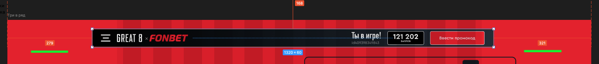
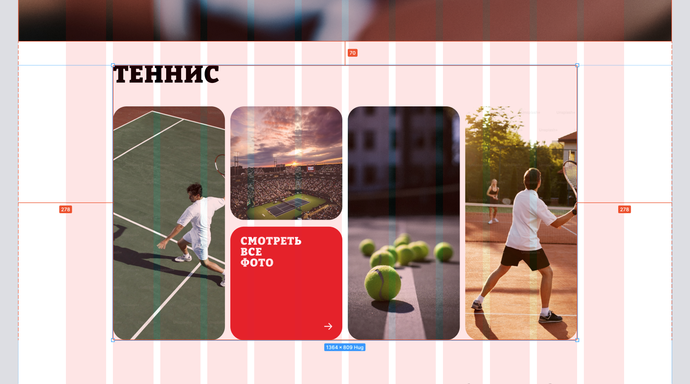

# Отступы от края и между элементами соответствуют сетке

[← к содержанию](../README.md)

## Плохо

1. Есть сетка, header её игнорирует, поэтому расположен не по центру.

    

2. Есть сетка, элементы её игнорируют, левый блок имеет произвольную ширину, расстояние между границами страницы не одинаковое. При изменении текста он может сильно выйти влево.
3. Не понятно какой отступ между левым и правым блоком.

    

## Хорошо

1. Есть сетка, элементы расположены согласно её направляющим, расстояние между ними так же учитывают сетку.

    

2. Есть сетка, контентная область её учитывает, элементы расположены по центру страницы, отступы одинаковые.

    
